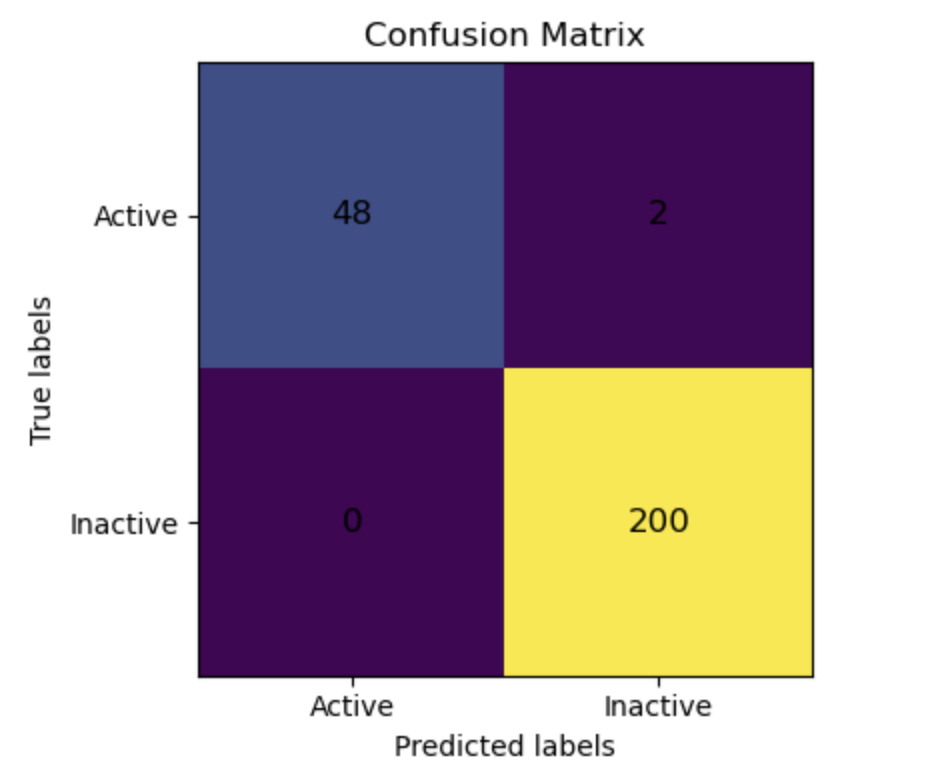

# patternrecognition-group1-exercise5
The results are based on the following parameters:

- **k** = 3  
- **Cn** = 1.0  
- **Ce** = 0.1  

---

Performance Metrics (Active Class):

**Metric / Value**  
Precision - 1.0  
Recall - 0.96  
F1-score - 0.9795918367346939

---

Confusion Matrix:  

---

Overall Accuracy:

Accuracy = 0.992
